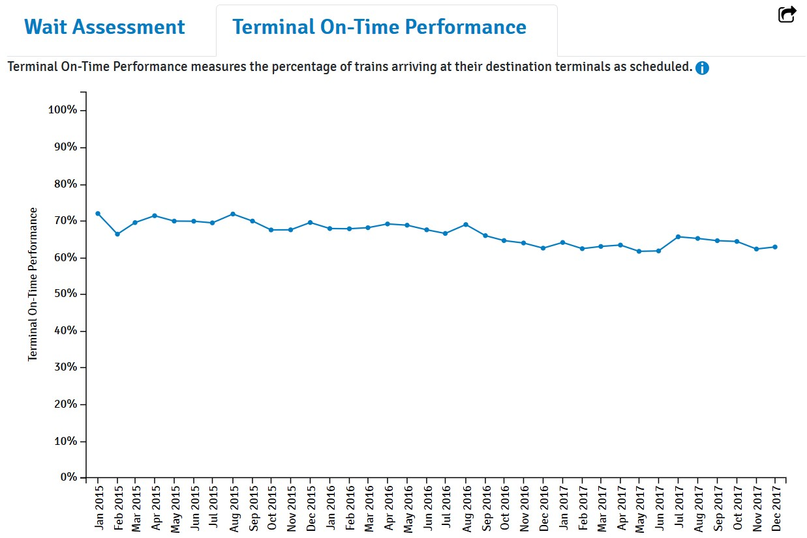
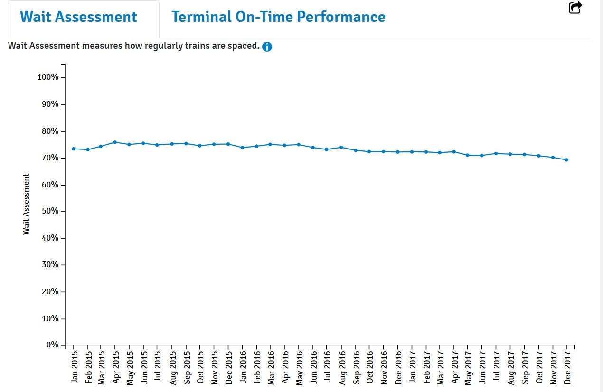

```{r setup, include=FALSE}
knitr::opts_chunk$set(echo = FALSE)
```


```{r message=FALSE, echo=FALSE, warning=FALSE}
library(tidyverse)
library(lubridate)
library(plotly)
library(scales)
```


```{r message=FALSE, echo=FALSE}
# read in datasets 
MTA_KPI <- read_csv('data/metropolitan-transportation-authority-mta-performance-indicators-per-agency-beginning-2008.csv')    # MTA KPI performance data 
```


It's no secret that New Yorkers love to hate their subway system. I was inspired to more critically analyze it after reading this [**CityLab**](https://www.citylab.com/transportation/2018/04/why-new-york-city-stopped-building-subways/557567/) article that contextualizes the history of the MTA. I am specifically interested in whether it truly is degrading by using their publically maintained performance metrics. Some of these metrics have opaque names, so I'll specify where necessary.  

***  

```{r echo=FALSE}
# convert Period to date variable
transit <- MTA_KPI

transit$Period <- paste(transit$Period, '-01', sep = '')

transit$Period <- transit$Period %>%
  ymd()

 # filter observations to only NYC Transit (Subway and Bus)
transit <- transit %>% 
  dplyr::filter(MTA_KPI$`Agency Name` == 'NYC Transit') %>%
  group_by(Period) 
```

```{r echo=FALSE, message=FALSE, out.width='100%'}
# plot ridership 
plt.NYC.riders <- transit %>% 
  dplyr::filter(`Indicator Name` == 'Total Ridership - Subways') %>%
  dplyr::filter(Period > '2015-01-01') %>% 
  ggplot(aes(x = Period, y = `Monthly Actual`)) + 
  geom_point(color = 'steelblue4', alpha = .7) + 
  geom_smooth(method = 'lm') + 
  ylab('Total Monthly Ridership - All Lines') +
  scale_y_continuous(labels = comma) +
  theme_classic()

# convert to plotly object
ggplotly(plt.NYC.riders) %>%
  layout(title = list(text = 'There is no clear trend of monthly ridership',
                      font = list(size = 15
                                  )
                      )
         ) %>% 
  config(displayModeBar = FALSE, scrollZoom = FALSE)
```

> "Terminal On-Time Performance measures the percentage of trains arriving at their destination terminals as scheduled. A train is counted as on-time if it arrives at its destination early, on time, or no more than five minutes late, and has not skipped any planned stops. TOTP is a legacy metric that provides a measure of trains arriving within the standard, and not a direct measure of customer travel time, particularly since relatively few customers travel all the way to the end of a line." --- MTA

```{r echo=FALSE, message=FALSE, out.width='100%'}
# plot On-Time Performance for all subway lines
plt.NYC.OTP <- transit %>% 
  dplyr::filter(`Indicator Name` == 'On-Time Performance (Terminal)') %>%
  dplyr::filter(Period > '2015-01-01') %>% 
  ggplot(aes(x = Period, y = `Monthly Actual`)) + 
  geom_point(color = 'steelblue4', alpha = .7) + 
  geom_smooth(method = 'lm') + 
  ylab('Monthly On-Time Performance - All Lines') +
  theme_classic()

# convert to plotly object
ggplotly(plt.NYC.OTP) %>% 
  layout(title = list(text = 'Subway cars are arriving at their destination on schedule less.',
                      font = list(size = 15
                                  )
                      )
         ) %>% 
  config(displayModeBar = FALSE, scrollZoom = FALSE)
```

> "Wait Assessment measures how regularly the trains are spaced during peak hours. To meet the standard, the headway (time between trains) can be no greater than 25% more than the scheduled headway. This provides a percentage of trains passing the standard, but does not account for extra service operated, is not weighted to how many customers are waiting for the trains at different stations, does not distinguish between relatively minor gaps in service and major delays, and is not a true measurement of time customers spend waiting on the platform." --- MTA

```{r echo=FALSE, message=FALSE, out.width='100%'}
# plot subway wait assessment for all subway lines
plt.NYC.SWA <- transit %>% 
  dplyr::filter(`Indicator Name` == 'Subway Wait Assessment') %>%
  dplyr::filter(Period > '2015-01-01') %>% 
  ggplot(aes(x = Period, y = `Monthly Actual`)) + 
  geom_point(color = 'steelblue4', alpha = .7) + 
  geom_smooth(method = 'lm') +
  ylab('Subway Wait Assessment - All Lines') +
  theme_classic()

# convert to plotly object
ggplotly(plt.NYC.SWA) %>% 
  layout(title = list(text = 'Subway cars are less routinely spaced during peak hours.', 
                      font = list(size = 15
                                  )
                      )
         ) %>% 
  config(displayModeBar = FALSE, scrollZoom = FALSE) 
```

> "Mean Distance Between Failures (MDBF) reports how frequently car-related problems such as door failures, loss of motor power, or brake issues cause a delay of over five minutes. It is calculated by dividing the number of miles train cars run in service by the number of incidents due to car‐related problems." --- MTA

```{r echo=FALSE, message=FALSE, out.width='100%'}
# plot mean distance between failures for all subway lines 
plt.NYC.fail <- transit %>% 
  dplyr::filter(`Indicator Name` == 'Mean Distance Between Failures - Subways') %>%
  dplyr::filter(Period > '2015-01-01') %>% 
  ggplot(aes(x = Period, y = `Monthly Actual`)) + 
  geom_point(color = 'steelblue4', alpha = .7) + 
  geom_smooth(method = 'lm') +
  ylab('Mean Distance Between Failures (Miles)') +
  scale_y_continuous(labels = comma) +
  theme_classic()

# convert to plotly object
ggplotly(plt.NYC.fail) %>% 
  layout(title = list(text = 'Subway cars are breaking down more frequently.',
                      font = list(size = 15
                                  )
                      )
         ) %>% 
  config(displayModeBar = FALSE, scrollZoom = FALSE)
```

There is a lot of information that can be lost in rapid-fire chart presentation, but the overall theme is that the subways of New York City are less reliable, break down more, and yet are responsible for moving more and more people.

An interesting note is that when looking at the MTA's [**performance dashboard**](http://dashboard.mta.info/), their charts use the same underlying data to tell a very different story. 





This is a perfect opportunity to weigh in on the [**perennial debate**](https://qz.com/418083/its-ok-not-to-start-your-y-axis-at-zero/) around [**truncated y axes**](https://guides.library.duke.edu/datavis/topten) with a concrete example. As is the case in most methodology questions, there are very few decisions that have a clear cut answer without room for nuance. When considering truncated y axes, one should express the question they are answering about their data in the decision.  

In subway performance metrics, I don't believe an axis that goes from 0-100% is truthfully expressing the question of whether the network is increasing or decreasing in performance. We do not care about a subway system that has a 0% On-Time Performance because such a system would not exist. We care more about comparing historic to current performance, and leaving a chart full of white space implies stability and lack of change in performance where that is not the case. It would be equally misleading if I were to reduce the axes to a percent or two to imply volatility where there is none, but there is a clear and consistent trend of worsening performance that is not insignificant across multiple metrics. For these reasons, the MTA should reconsider their philosophy for how they communicate data to the public.   